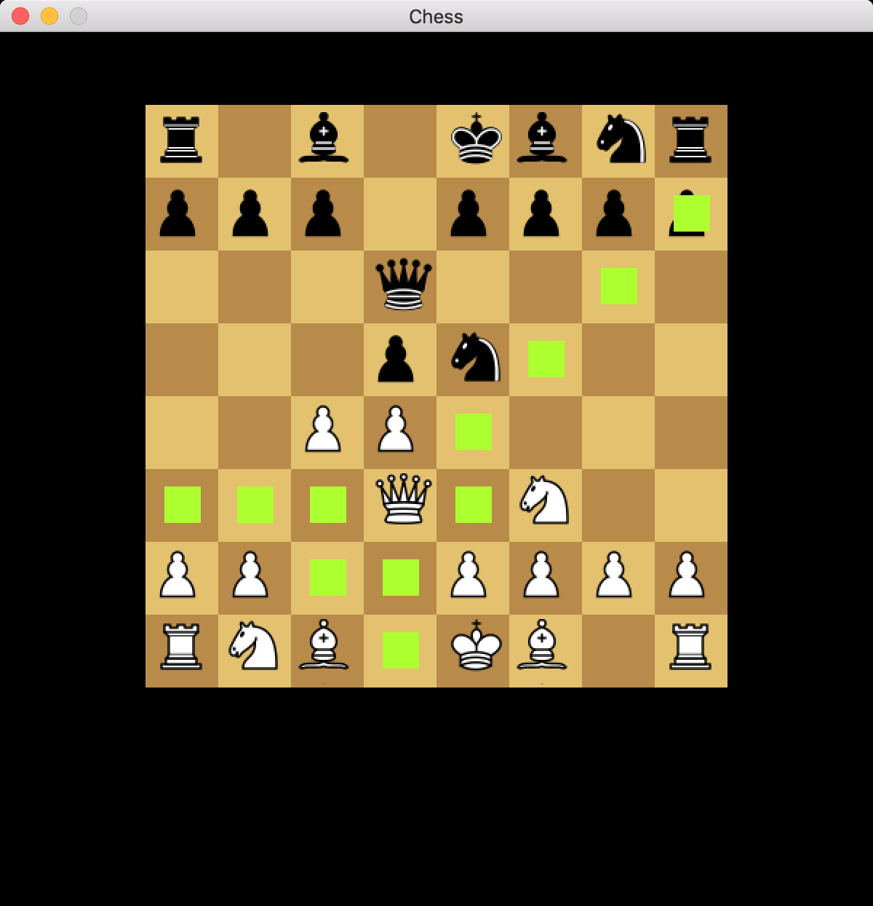
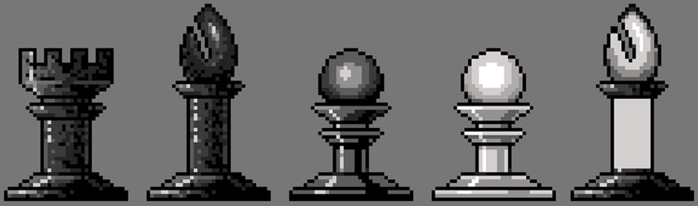

# 🚧 Go Chess

https://miketmoore.itch.io/chess

[](https://goreportcard.com/report/github.com/miketmoore/chess)

|                                                               |                                                               |                                                                        |
| ------------------------------------------------------------- | ------------------------------------------------------------- | ---------------------------------------------------------------------- |
|  |  |  |

## 🎮 Play

You can [download the latest published binary](https://miketmoore.itch.io/chess) from itch.io or build from source.

## 📦 Build and Run from Source

```
# Get dependencies, run tests, and build binary:
mkdir $GOPATH/src/github.com/miketmoore
cd $GOPATH/src/github.com/miketmoore
git clone github.com/miketmoore/chess
cd chess
make 

# Run 
./chess
```

## 📝 Credit

- Fonts by [Kenney](http://kenney.nl/support)
- Chess pieces from [Wikipedia](https://commons.wikimedia.org/wiki/Category:PNG_chess_pieces/Standard_transparent#/media/File:ChessPiecesArray.png)
- Board color schemes from [OMG Chess](http://omgchess.blogspot.com/2015/09/chess-board-color-schemes.html)

## 🎨 Custom Game Art - Work in Progress

I am drawing a set of chess pieces for this game. You can follow my progress on [Flickr](https://www.flickr.com/photos/miketmoore/albums/72157693792363695).


