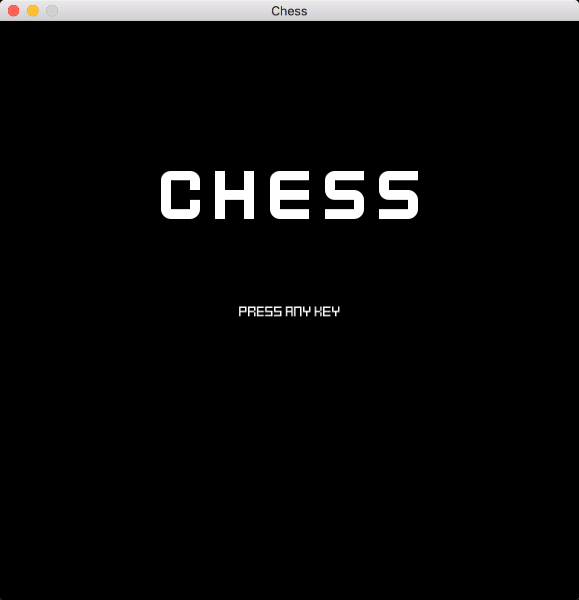
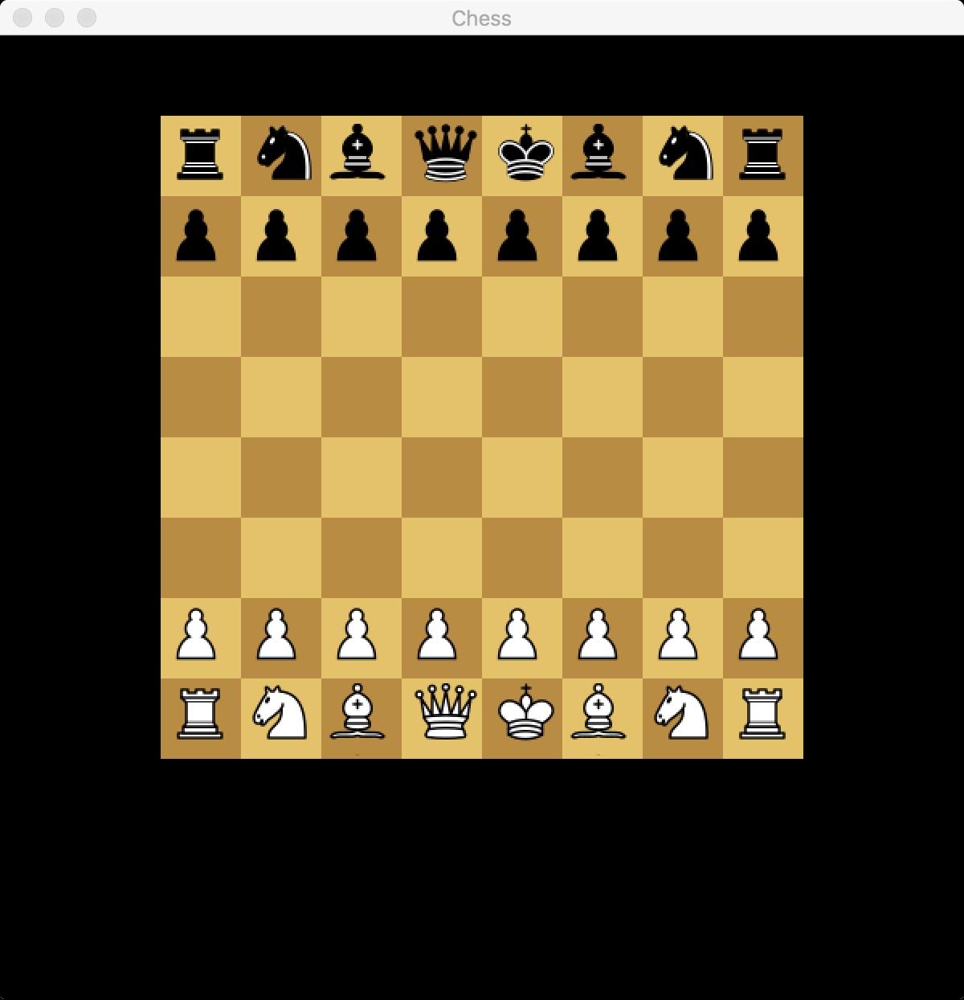

# Go Chess :construction:

This is a work in progress.

[](https://goreportcard.com/report/github.com/miketmoore/chess)

```
go get github.com/miketmoore/chess
```




## Play Game

```
go run cmd/chess/chess.go
```

## Credit

* Fonts by [Kenney](http://kenney.nl/support)
* Chess pieces from [Wikipedia](https://commons.wikimedia.org/wiki/Category:PNG_chess_pieces/Standard_transparent#/media/File:ChessPiecesArray.png)
* Board color schemes from [OMG Chess](http://omgchess.blogspot.com/2015/09/chess-board-color-schemes.html)
