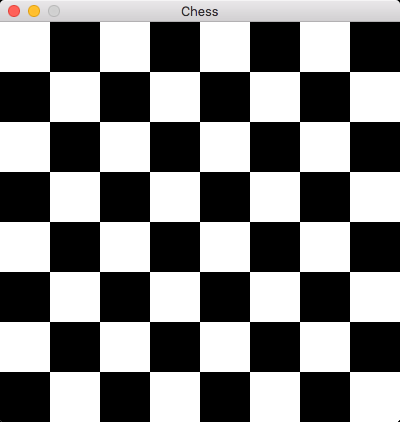

# Go Chess

This is a work in progress.

[](https://goreportcard.com/report/github.com/miketmoore/go-chess)

```
go get github.com/miketmoore/go-chess
```

## Draw Board



```
go run cmd/board/board.go
```
